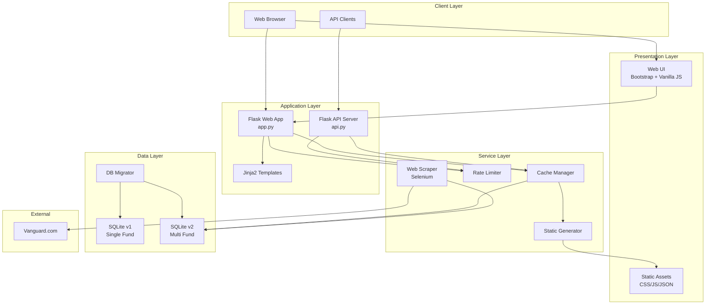

# VTSAX Holdings Tracker - System Design Document

## Table of Contents
1. [Overview](#overview)
2. [Architecture](#architecture)
3. [Technology Stack](#technology-stack)
4. [Components](#components)
5. [Data Flow](#data-flow)
6. [API Specification](#api-specification)
7. [Database Schema](#database-schema)
8. [Security & Performance](#security--performance)
9. [Deployment](#deployment)
10. [Future Enhancements](#future-enhancements)

## Overview

The VTSAX Holdings Tracker is a web application that provides real-time access to Vanguard index fund holdings data. Originally built for VTSAX (Vanguard Total Stock Market Index Fund), it's being expanded to support multiple Vanguard funds including VOO, VTI, VUG, and VTV.

### Key Features
- Real-time search of fund holdings by ticker or company name
- Display of top holdings by percentage
- Automated data collection from Vanguard
- Free tier optimized with intelligent caching and rate limiting
- RESTful API for programmatic access
- Responsive web interface

## Architecture



### Architecture Principles
1. **Separation of Concerns**: Clear boundaries between presentation, business logic, and data layers
2. **Caching First**: Multiple caching layers to minimize database hits and API calls
3. **Graceful Degradation**: System continues to function even when rate limits are reached
4. **Progressive Enhancement**: Started simple (single fund) and expanding to multiple funds
5. **API-First Design**: Core functionality exposed through RESTful endpoints

## Technology Stack

### Backend
- **Language**: Python 3.x
- **Framework**: Flask 3.1.1
- **WSGI Server**: Waitress (production)
- **Database**: SQLite
- **ORM**: Raw SQL (no ORM for performance)

### Frontend
- **HTML**: Jinja2 templates
- **CSS**: Bootstrap 5.1.3 + Custom styles
- **JavaScript**: Vanilla ES6+
- **Icons**: Bootstrap Icons

### Data Collection
- **Web Scraping**: Selenium WebDriver
- **Browser**: Chrome/Chromium (headless mode)
- **HTML Parsing**: BeautifulSoup4
- **Data Processing**: Pandas, NumPy

### Dependencies
```python
# Core
Flask==3.1.1
Flask-Cors==5.0.0

# Data Collection
selenium==4.27.1
beautifulsoup4==4.12.3
pandas==2.2.3
numpy==2.2.1

# HTTP & Parsing
requests==2.32.3
lxml==5.3.0

# Production Server
waitress==3.0.2
```

## Components

### 1. Web Application (`app.py`)
- Serves the main web interface
- Handles both UI routes and API endpoints
- Integrates rate limiting and caching
- Features:
  - `/` - Main search interface
  - `/api/*` - RESTful API endpoints
  - Static file serving with caching headers

### 2. API Server (`api.py`)
- Lightweight API-only server
- Minimal dependencies
- Suitable for microservice deployment
- CORS enabled for cross-origin requests

### 3. Database Layer
#### Version 1 (`database.py`)
- Single table structure for VTSAX holdings
- Simple schema: ticker, company_name, percentage

#### Version 2 (`database_v2.py`)
- Multi-fund support with normalized schema
- Tables: funds, holdings, fund_holdings (junction)
- Foreign key relationships
- Prepared statements for security

### 4. Web Scraper (`scraper_multi.py`)
- Selenium-based automation
- Supports multiple Vanguard funds
- Handles dynamic JavaScript content
- Features:
  - Automatic retry logic
  - Error handling for network issues
  - CSV parsing and validation
  - Batch database updates

### 5. Rate Limiter (`free_tier_limiter.py`)
- Sliding window rate limiting
- Multiple limit tiers (per second, minute, hour, day)
- Graceful degradation
- In-memory tracking with periodic cleanup

### 6. Cache Manager (`safe_cache.py`)
- Multi-tier caching strategy
- In-memory cache with TTL
- Fallback to static files
- Cache warming on startup

### 7. Static Generator (`generate_static.py`)
- Pre-generates common API responses
- Reduces runtime computation
- Updates on data changes
- Serves as ultimate fallback

## Data Flow

### 1. Data Collection Flow
```
Vanguard Website → Selenium Scraper → CSV Download → 
Pandas Processing → Database Insert → Cache Invalidation
```

### 2. API Request Flow
```
Client Request → Rate Limiter Check → Cache Lookup → 
[Cache Hit] → Return Cached Data
[Cache Miss] → Database Query → Cache Update → Return Data
```

### 3. Static Fallback Flow
```
Rate Limit Exceeded → Check Static Files → 
[Found] → Return Static Data
[Not Found] → Return Error with Retry-After
```

## API Specification

### Base URLs
- Development: `http://localhost:5000/api`
- Production: `https://yourdomain.com/api`

### Endpoints

#### 1. Search Holdings
```
GET /api/search?q={query}
```
- **Parameters**: 
  - `q` (required): Search query for ticker or company name
- **Response**: Array of matching holdings
```json
[
  {
    "ticker": "AAPL",
    "company_name": "Apple Inc",
    "percentage": 6.82
  }
]
```

#### 2. Top Holdings
```
GET /api/holdings/top?limit={n}
```
- **Parameters**: 
  - `limit` (optional): Number of holdings to return (default: 50)
- **Response**: Array of top holdings by percentage

#### 3. Check Stock Ownership
```
GET /api/owns/{ticker}
```
- **Parameters**: 
  - `ticker` (required): Stock ticker symbol
- **Response**: 
```json
{
  "owns": true,
  "data": {
    "ticker": "AAPL",
    "company_name": "Apple Inc",
    "percentage": 6.82
  }
}
```

#### 4. Database Statistics
```
GET /api/stats
```
- **Response**: 
```json
{
  "total_holdings": 3567,
  "last_updated": "2025-01-24T10:30:00Z",
  "funds_tracked": ["VTSAX", "VOO", "VTI"]
}
```

#### 5. Health Check
```
GET /api/health
```
- **Response**: 
```json
{
  "status": "healthy",
  "database": "connected",
  "cache": "active",
  "uptime": 3600
}
```

#### 6. Usage Statistics
```
GET /api/usage
```
- **Response**: Rate limit usage information

### Error Responses
```json
{
  "error": "Rate limit exceeded",
  "retry_after": 60,
  "message": "Please try again later"
}
```

## Database Schema

### Version 2 Schema (Multi-Fund)

```sql
-- Funds table
CREATE TABLE funds (
    id INTEGER PRIMARY KEY AUTOINCREMENT,
    symbol TEXT NOT NULL UNIQUE,
    name TEXT NOT NULL,
    last_updated TIMESTAMP
);

-- Holdings table
CREATE TABLE holdings (
    id INTEGER PRIMARY KEY AUTOINCREMENT,
    ticker TEXT NOT NULL UNIQUE,
    company_name TEXT NOT NULL,
    UNIQUE(ticker)
);

-- Junction table for many-to-many relationship
CREATE TABLE fund_holdings (
    fund_id INTEGER,
    holding_id INTEGER,
    percentage REAL NOT NULL,
    shares INTEGER,
    market_value REAL,
    PRIMARY KEY (fund_id, holding_id),
    FOREIGN KEY (fund_id) REFERENCES funds(id),
    FOREIGN KEY (holding_id) REFERENCES holdings(id)
);

-- Indexes for performance
CREATE INDEX idx_holdings_ticker ON holdings(ticker);
CREATE INDEX idx_holdings_company ON holdings(company_name);
CREATE INDEX idx_fund_holdings_percentage ON fund_holdings(percentage DESC);
```

## Security & Performance

### Security Measures
1. **SQL Injection Prevention**: Parameterized queries throughout
2. **XSS Protection**: HTML escaping in templates
3. **CORS Configuration**: Restricted to specific origins in production
4. **Input Validation**: All user inputs sanitized
5. **No Sensitive Data**: No user accounts or personal information stored

### Performance Optimizations
1. **Database Indexes**: On frequently queried columns
2. **Connection Pooling**: Reused database connections
3. **Query Optimization**: Minimal joins, efficient WHERE clauses
4. **Caching Strategy**:
   - In-memory cache: 5-minute TTL
   - Static files: Hourly regeneration
   - Browser cache: Appropriate cache headers
5. **Rate Limiting**: Prevents abuse and ensures fair usage

### Free Tier Optimization
- Request limits: 60/minute, 1000/hour
- Static fallbacks for common queries
- Efficient database queries (no full table scans)
- Minimal memory footprint
- Graceful degradation under load

## Deployment

### Prerequisites
- Python 3.8+
- Chrome/Chromium browser (for scraping)
- SQLite support
- 512MB RAM minimum
- 1GB storage for database and cache

### Deployment Options

#### 1. Heroku Free Tier
```bash
# Procfile
web: waitress-serve --port=$PORT app:app
worker: python scraper_multi.py
```

#### 2. Railway/Render
- Automatic deployment from GitHub
- Environment variable configuration
- Scheduled jobs for scraping

#### 3. VPS Deployment
```bash
# Setup virtual environment
python -m venv venv
source venv/bin/activate

# Install dependencies
pip install -r requirements.txt

# Run with systemd service
sudo systemctl start vtsax-tracker
```

### Environment Variables
```bash
FLASK_ENV=production
DATABASE_URL=sqlite:///index_funds.db
CACHE_DIR=/app/cache
SCRAPE_INTERVAL=3600
RATE_LIMIT_ENABLED=true
```

### Monitoring
- Health check endpoint for uptime monitoring
- Error logging to file/console
- Performance metrics in `/api/usage`
- Database size monitoring

## Future Enhancements

### Planned Features
1. **International Funds**: Support for international Vanguard funds
2. **Historical Data**: Track holdings changes over time
3. **Webhooks**: Notify when holdings change significantly
4. **GraphQL API**: More flexible data queries
5. **Mobile App**: Native iOS/Android applications

### Technical Improvements
1. **PostgreSQL Migration**: For better concurrent performance
2. **Redis Cache**: Distributed caching for scalability
3. **Message Queue**: Async processing for scraping jobs
4. **Container Orchestration**: Kubernetes deployment
5. **CDN Integration**: Static asset delivery

### Data Enhancements
1. **Sector Analysis**: Categorize holdings by sector
2. **Performance Metrics**: Include returns and volatility
3. **ESG Scores**: Environmental, social, governance data
4. **Real-time Updates**: WebSocket support for live data
5. **Data Export**: CSV/Excel download functionality

## Conclusion

The VTSAX Holdings Tracker demonstrates efficient design principles for building a production-ready application within free tier constraints. The architecture prioritizes performance, reliability, and user experience while maintaining simplicity and ease of deployment.

Key strengths:
- **Efficient Resource Usage**: Optimized for free tier hosting
- **Scalable Architecture**: Easy to extend for new features
- **User-Focused Design**: Fast, responsive interface
- **Reliable Data Collection**: Robust scraping with error handling
- **API-First Approach**: Enables ecosystem development

The system successfully balances functionality with resource constraints, providing a valuable service to investors tracking Vanguard index funds.